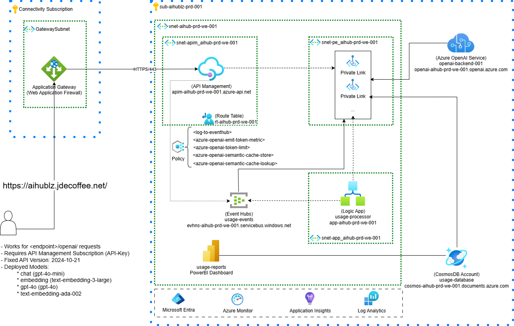

# JDE-IT-AIHUB

The AI Hub Gateway Landing Zone is a solution that enables JDE tenants to use OpenAI services securely.

The architecture is designed to be a central hub for AI services, providing a single point of entry for AI requests, and enabling the organization to manage and govern AI services in a consistent manner.

---

## 📐 Architecture

---

## What changed (short summary)

This repository has moved to a Terraform-first model for APIM and Azure OpenAI management as part of the ApiManagement_v2 work:

- APIM and *nested APIM resources* (policy fragments, named values, loggers, backends, APIs, products & subscriptions) are now managed by Terraform modules.
- New modules:
  - infra/module/apim — APIM instance + nested resources (policy fragments, backends, named values, loggers).
  - infra/module/subscriptions — APIM Products and Subscriptions.
- APIs are instantiated via a variable-driven loop (api_definitions) that binds OpenAPI specs in the repo to APIM APIs.
- Policy fragments are now stored in the repo and deployed by Terraform from infra/module/apim/fragments/.
- terraform.tfvars at repo root is the canonical place for non-sensitive defaults (openai_deployments, apim_backends, api_definitions, apim_subscriptions, apim_cache_version, etc.).
- Power BI artifacts remain outside Terraform (Power BI deployment still manual).

Only information that is no longer applicable was removed from the docs — everything relevant and previously documented was preserved and integrated with the Terraform-first workflow.

---

## 📘 Guidelines Overview

### 📦 [Deployment Instructions](./guides/deployment.md)

- [Environment Setup](./guides/deployment.md#environment-setup)
- [Initial Provisioning](./guides/deployment.md#initial-provisioning)
  - [1. Provision Infrastructure (Terraform)](./guides/deployment.md#1-provision-infrastructure)
- [Post-Provision Steps (Terraform-managed where possible)](./guides/deployment.md#post-provision-steps)
  - [2. APIM Nested Resources (now deployed by Terraform)](./guides/deployment.md#2-apim-nested-resources)
  - [3. Policy Fragments (deployed via Terraform)](./guides/deployment.md#3-policy-fragments)
  - [4. Assign Cosmos DB Role (brief)](./guides/deployment.md#4-assign-cosmos-db-role)
  - [5. Set Logic App API Connection (brief)](./guides/deployment.md#5-set-logic-app-api-connection)
  - [6. Deploy Logic App Source Code (brief)](./guides/deployment.md#6-deploy-logic-app-source-code)
- [Final Steps](./guides/deployment.md#final-steps)
  - [7. Enable API Specifications Deployment](./guides/deployment.md#7-enable-api-specifications-deployment)
  - [8. Deploy API Specifications and Policies (Terraform-first)](./guides/deployment.md#8-deploy-api-specifications-and-policies)
  - [9. Deployment Parameters](./guides/deployment.md#9-deployment-parameters)
- [Summary](./guides/deployment.md#summary)

---

### 🔌 [Understanding APIM Assets](./guides/apim-assets.md)

- [🛠️ Operational Notes](./guides/apim-assets.md#️-operational-notes)
- [🔐 Named Values](./guides/apim-assets.md#-named-values)
  - [➕ Provisioning (Terraform)](./guides/apim-assets.md#-provisioning)
  - [📋 Defined Named Values](./guides/apim-assets.md#-defined-named-values)
- [🧩 Policy Fragments](./guides/apim-assets.md#-policy-fragments)
  - [🔧 Deployed Fragments (repo-backed)](./guides/apim-assets.md#-deployed-fragments)
- [📜 Loggers](./guides/apim-assets.md#-loggers)
- [📦 API Usage of Fragments](./guides/apim-assets.md#-api-usage-of-fragments)
- [🔁 Backends](./guides/apim-assets.md#-backends)
  - [Key Points](./guides/apim-assets.md#key-points)
- [🔌 APIs](./guides/apim-assets.md#-apis)
  - [Policy Flow](./guides/apim-assets.md#policy-flow)
  - [Dependencies](./guides/apim-assets.md#dependencies)
  - [Usage](./guides/apim-assets.md#usage)
- [🔌 OpenAI API Policy](./guides/apim-assets.md#-openai-api-policy)
- [📦 Subscriptions and Products](./guides/apim-assets.md#-subscriptions-and-products)
  - [Products](./guides/apim-assets.md#products)
  - [Subscriptions](./guides/apim-assets.md#subscriptions)
- [🔗 Additional Resources](./guides/apim-assets.md#-additional-resources)

---

### 🧭 [APIM Variable Mapping](./guides/apim-variable-mapping.md)

- [Variable naming conventions](./guides/apim-variable-mapping.md#variable-naming-conventions)
- [Mapping rules & examples](./guides/apim-variable-mapping.md#mapping-rules--examples)
- [Named values to policy variable mappings](./guides/apim-variable-mapping.md#named-values-to-policy-variable-mappings)

---

### 🧾 [Subscription Management](./guides/subscriptions.md)

- [📦 Define Subscriptions as Code](./guides/subscriptions.md#-define-subscriptions-as-code)
  - [Terraform Variable: `apim_subscriptions`](./guides/subscriptions.md#terraform-variable-apim_subscriptions)
  - [JSON / HCL Example](./guides/subscriptions.md#json-example)
- [➕ Add a New Subscription and Product](./guides/subscriptions.md#-add-a-new-subscription-and-product)
- [➖ Remove or Suspend a Subscription](./guides/subscriptions.md#-remove-or-suspend-a-subscription)
  - [❌ Remove a Subscription](./guides/subscriptions.md#-remove-a-subscription)
  - [🚫 Suspend or Disable a Subscription](./guides/subscriptions.md#-suspend-or-disable-a-subscription)
- [🔐 Restrict Access to Specific Models](./guides/subscriptions.md#-restrict-access-to-specific-models)
  - [Model RBAC Policy (fragment: frag-model-rbac)](./guides/subscriptions.md#model-rbac-policy-fragment-model-rbac)
  - [How to Restrict Model Access](./guides/subscriptions.md#how-to-restrict-model-access)
- [📉 Apply Token Limits per Subscription](./guides/subscriptions.md#-apply-token-limits-per-subscription)
  - [Token Limits Policy (fragment: frag-token-limits)](./guides/subscriptions.md#token-limits-policy-frag-token-limits)
  - [How to Apply a Custom Token Limit](./guides/subscriptions.md#how-to-apply-a-custom-token-limit)

---

### 🤖 [OpenAI Instance & Model Management](./guides/openai-deployments.md)

- [🧠 Variable: `openai_deployments`](./guides/openai-deployments.md#-variable-openai_deployments)
- [✅ Example (from terraform.tfvars)](./guides/openai-deployments.md#-json-example)
- [🔧 How to deploy a new OpenAI instance (Terraform)](./guides/openai-deployments.md#-how-to-deploy-a-new-openai-instance)
- [🔧 Create APIM backend for new instance (Terraform)](./guides/openai-deployments.md#-how-to-create-a-new-apim-backend-for-the-new-openai-instance)
- [🔧 Add backend to routes (Terraform)](./guides/openai-deployments.md#-how-to-add-the-new-apim-backend-to-the-apim-routes)
- [🔧 Add deployment models to clusters (Terraform)](./guides/openai-deployments.md#-how-to-add-the-deployment-models-of-the-new-instances-to-the-apim-clusters)
- [🔧 Invalidate route cache (apim_cache_version)](./guides/openai-deployments.md#-how-to-invalidate-the-route-cache)
- [🔧 Deploy new model in existing instance (Terraform)](./guides/openai-deployments.md#-how-to-deploy-a-new-deployment-model-in-an-existing-openai-instance)
- [🔧 Add new models of existing instance (Terraform)](./guides/openai-deployments.md#-how-to-add-the-new-deployment-models-of-an-existing-openai-instance-to-the-apim)
- [🔗 Reference](./guides/openai-deployments.md#-reference)

---

### 📊 [Power BI Dashboard](./guides/powerbi-dashboard.md)

- [📁 Dashboard File Location](./guides/powerbi-dashboard.md#-dashboard-file-location)
- [⚠️ Prerequisites](./guides/powerbi-dashboard.md#️-prerequisites)
  - [✅ 1. Your IP Can Access CosmosDB](./guides/powerbi-dashboard.md#-1-your-ip-can-access-cosmosdb)
  - [✅ 2. Set Correct Power BI Credentials](./guides/powerbi-dashboard.md#-2-set-correct-power-bi-credentials)
- [🧠 What the Dashboard Shows](./guides/powerbi-dashboard.md#-what-the-dashboard-shows)
- [🔄 Refreshing the Dashboard](./guides/powerbi-dashboard.md#-refreshing-the-dashboard)
- [🛠️ Troubleshooting](./guides/powerbi-dashboard.md#️-troubleshooting)
- [🧭 Need Help?](./guides/powerbi-dashboard.md#-need-help)

---

## How to use this repo (short)

- Edit repo-root terraform.tfvars for non-sensitive defaults (openai_deployments, apim_backends, api_definitions, apim_subscriptions, apim_cache_version).
- Run Terraform from infra/ (init → plan → apply).
- Most APIM nested resources (fragments, backends, named values, products & subscriptions) are created/updated by Terraform — no manual portal steps required.
- Power BI is still managed outside Terraform (see guides/powerbi-dashboard.md).

---

## Where to find module schemas

- infra/var.tf — top-level variables
- infra/module/<module>/var.tf — per-module variable schema (apim, apis, openai, subscriptions, etc.)
- infra/module/*/README.md — module-level docs (terraform-docs)

---

## Contact / Support

For operational questions, PR review, or docs clarifications, please open an issue or ping the repository maintainers.

---
